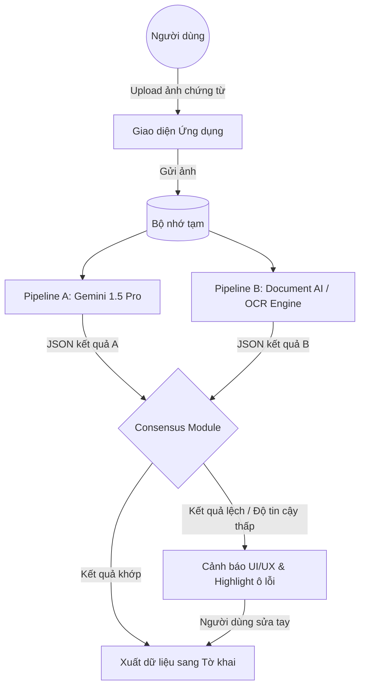

# Demo: Sơ đồ kiến trúc Double OCR Pipeline

### Giải thích:
- **Consensus Module**: Là bộ não của kiến trúc, thực hiện so sánh từng trường dữ liệu.
- **Dữ liệu an toàn**: Chỉ khi cả 2 nguồn cùng đồng thuận thì dữ liệu mới được coi là "sạch" để đi tiếp.
